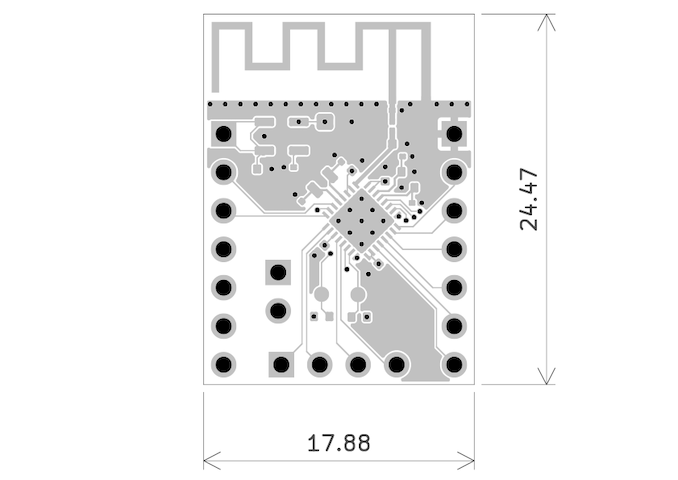

# ESP32-C3-THTKIT
**Ultra-Compact THT-Friendly DevKit**

---

## Overview

ESP32-C3-THTKIT is an ultra-compact development board based on the ESP32-C3FH4 SoC. Designed for direct THT integration, it exposes only essential functionality in a minimal form factor. UART pins are easily accessible at the top for in-circuit development.

---

## Pinout

- Left header (THT): VIN, GPIO2 to GPIO19
- Right header (THT): GND, GPIO17 to GPIO12 (FSPI2 by default)
- Bottom header (THT): GPIO4 to GPIO7 (JTAG by default)
- Top edge: UART TX/RX pins
- BOOT/RESET: pad-based activation (short to GND)
- Pin pitch: 2.54 mm standard
- Bottom header deliberately offset by 1.27 mm (half pitch) to prevent accidental shorts when inserted into a breadboard

---

## Programming & Debugging

- UART programming recommended via top pins
- JTAG available on bottom header (default mapping)
- No USB functionality

---

## Electrical

- Input Voltage: 3.3V to 12V
- On-board LDO stabilizes to 3.3V
- No onboard USB

---

## Mechanical

- Dimensions: 24.47 mm x 17.88 mm
- 3x THT headers: left, right, and optional bottom (user-soldered)

---

## Datasheet

[📄 ESP32-H2-THTKIT Datasheet (PDF)](docs/Datasheet.pdf)

[📄 ESP32-H2 Datasheet (Espressif)](https://cdn.jsdelivr.net/gh/sivakov512/kicad-library@master/datasheets/MCU/Espressif/Espressif_ESP32-H2.pdf)

---
