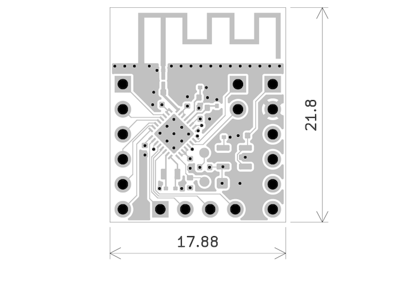

# ESP32-H2-THTKIT
**Ultra-Compact THT-Friendly DevKit**

---

## Overview

ESP32-H2-THTKIT is an ultra-compact development board based on the ESP32-H2FH4 SoC. Designed for direct integration into through-hole (THT) projects, it contains only the essential components and remains breadboard-friendly. UART debug pins are routed to the top for easy access during development, regardless of installation density.

---

## Pinout

- Left header (THT): GPIO0 to GPIO5 (also FSPI2-capable)
- Right header (THT): VIN, GND, GPIO27 to GPIO22
- Bottom header (THT): GPIO8, GPIO10, GPIO11, GPIO12 (can be used as JTAG)
- Top edge: UART TX/RX pins
- BOOT/RESET: pad-based activation (short to GND)
- Pin pitch: 2.54 mm standard; bottom header offset by 1.27 mm for breadboard clearance

---

## Programming & Debugging

- UART programming recommended via top pins
- JTAG support via GPIO8/10/11/12 (if remapped)
- No USB functionality

---

## Electrical

- Input Voltage: 3.3V to 12V
- On-board LDO stabilizes to 3.3V
- No onboard USB

---

## Mechanical

- Dimensions: 21.8 mm x 17.88 mm
- 3x THT headers: left, right, and optional bottom (user-soldered)

---

## Datasheet

[📄 ESP32-C3-THTKIT Datasheet (PDF)](docs/Datasheet.pdf)

[📄 ESP32-C3 Datasheet (Espressif)](https://cdn.jsdelivr.net/gh/sivakov512/kicad-library@master/datasheets/MCU/Espressif/Espressif_ESP32-C3.pdf)

---
